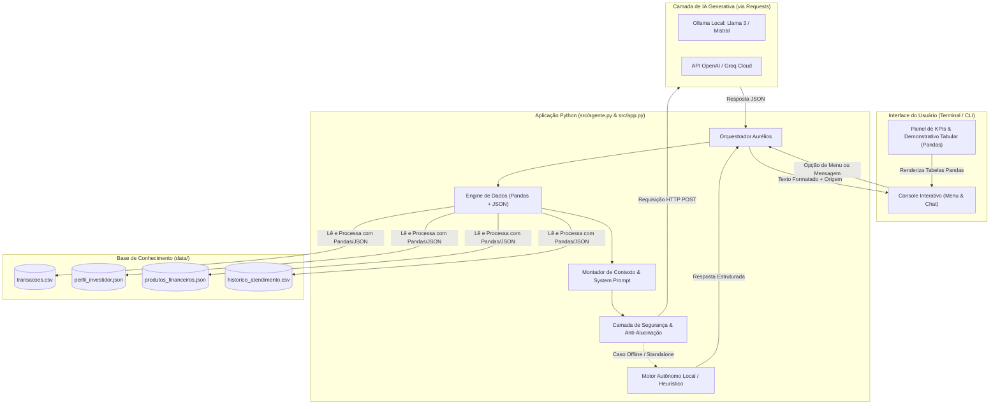

# Aurélios — Assistente Virtual Financeiro Inteligente com IA Generativa

[](https://www.python.org/)
[](https://docs.python.org/3/)
[](https://pandas.pydata.org/)
[](https://requests.readthedocs.io/)
[](https://www.dio.me/)

> **Aurélios** é um mentor e assistente virtual financeiro inteligente desenvolvido para o desafio de projeto da **Digital Innovation One (DIO)**: *"Construa Seu Assistente Virtual Com Inteligência Artificial"*, inspirado na evolução da IA no setor financeiro.

Inspirado na sabedoria, racionalidade e disciplina do imperador filósofo Marco Aurélio, o **Aurélios** atua de forma consultiva e proativa através de uma **interface limpa de terminal (CLI)**, garantindo execução instantânea, ausência de falhas visuais ou dependências pesadas, e oferecendo **fidelidade estrita aos dados e proteção contra alucinações**.

---

## Destaques do Projeto

- **Execução Leve e Ágil via Terminal (CLI):** Arquitetura limpa sem sobrecarga de servidores web, com inicialização instantânea e menus interativos;
- **Análise Contábil com Pandas:** Processamento determinístico de extratos (`transacoes.csv`), eliminando erros matemáticos e alucinações aritméticas comuns em LLMs;
- **Grounding em Dados Reais:** Base de conhecimento em `JSON` com perfil de risco do cliente (`perfil_investidor.json`) e catálogo de produtos homologados (`produtos_financeiros.json`);
- **Integração Flexível de APIs via Requests:** Suporte nativo a múltiplos provedores de LLM:
  - **Motor Autônomo Local:** Motor heurístico inteligente e local para respostas imediatas sem dependência de conexões externas;
  - **Ollama (Local):** 100% privado, local e sem custos (ex: Llama 3, Mistral, Gemma 2);
  - **APIs em Nuvem:** Suporte a endpoints padrão OpenAI, Groq Cloud e compatíveis.
- **Segurança e Suitability:** O assistente respeita a aversão a risco de clientes conservadores/moderados, prioriza a consolidação da reserva de emergência antes de sugerir renda variável e bloqueia tentativas de captura de credenciais bancárias.

---

## Arquitetura da Solução



---

## Mapeamento das 6 Etapas do Desafio DIO

O projeto cumpre integralmente os 6 passos recomendados no laboratório:

| Etapa | Descrição | Arquivo no Repositório |
|:-----:|-----------|------------------------|
| **1** | **Documentação do Agente** | [`docs/01-documentacao-agente.md`](./docs/01-documentacao-agente.md) — Caso de uso, persona estoica, tom de voz, arquitetura e salvaguardas de segurança. |
| **2** | **Base de Conhecimento** | [`docs/02-base-conhecimento.md`](./docs/02-base-conhecimento.md) — Engenharia de dados, tabelas mockadas em [`data/`](./data/) e contexto montado para a IA. |
| **3** | **Prompts do Agente** | [`docs/03-prompts.md`](./docs/03-prompts.md) — System prompt completo, técnicas few-shot e tratamento de edge cases (escopo e senhas). |
| **4** | **Aplicação Funcional** | [`src/app.py`](./src/app.py) & [`src/agente.py`](./src/agente.py) — Aplicação interativa em terminal com suporte a APIs via Requests e análise via Pandas. |
| **5** | **Avaliação e Métricas** | [`docs/04-metricas.md`](./docs/04-metricas.md) — Bateria de 7 testes estruturados com 100% de aprovação e métricas humanas de usabilidade. |
| **6** | **Pitch (3 Minutos)** | [`docs/05-pitch.md`](./docs/05-pitch.md) — Roteiro de pitch de alto impacto cronometrado em 3 minutos para apresentação. |

---

## Estrutura do Repositório

```text
dio-lab-bia-do-futuro/
│
├── README.md                           # Documentação principal do projeto
├── .gitignore                          # Configuração de arquivos ignorados no Git
│
├── data/                               # Base de conhecimento mockada
│   ├── historico_atendimento.csv       # Histórico de atendimentos anteriores
│   ├── perfil_investidor.json          # Perfil, patrimônio e metas do cliente
│   ├── produtos_financeiros.json       # Catálogo de produtos homologados
│   └── transacoes.csv                  # Histórico de receitas e despesas
│
├── docs/                               # Entregáveis das etapas de documentação
│   ├── 01-documentacao-agente.md       # Persona, caso de uso e arquitetura
│   ├── 02-base-conhecimento.md         # Estratégia de integração com Pandas/JSON
│   ├── 03-prompts.md                   # System Prompt, Few-Shot e Edge Cases
│   ├── 04-metricas.md                  # Resultados de testes e métricas
│   └── 05-pitch.md                     # Roteiro de apresentação de 3 minutos
│
├── src/                                # Código-fonte da aplicação funcional
│   ├── app.py                          # Aplicação interativa de linha de comando (CLI)
│   ├── agente.py                       # Orquestrador do agente, Pandas e Requests
│   ├── config.py                       # Configurações de caminhos e endpoints
│   ├── requirements.txt                # Dependências Python (pandas, requests)
│   ├── test_agente.py                  # Suíte de testes automatizados
│   └── README.md                       # Guia de execução da aplicação
│
└── assets/                             # Recursos de apoio e roteiros das aulas
    ├── README.md
    └── RoteiroLab.md
```

---

## Como Executar o Projeto

### 1. Clonar o Repositório
```bash
git clone https://github.com/JVZerinho/dio-lab-bia-do-futuro.git
cd dio-lab-bia-do-futuro
```

### 2. Instalar as Dependências
```bash
pip install -r src/requirements.txt
```

### 3. Executar o Aurélios
```bash
python src/app.py
```

---

## Exemplos de Interações com o Aurélios

O menu principal aceita tanto o número da opção quanto qualquer pergunta digitada diretamente:

1. **Dicas Práticas de Economia:**  
   > **Entrada:** Opção `[1]` ou pergunta: *"Quais dicas de economia você recomenda?"*  
   > **Aurélios:** Apresenta a regra 50/30/20 adaptada ao seu orçamento (necessidades, estilo de vida e poupança), estratégias para reduzir a maior despesa (Moradia - R$ 1.380,00) e métodos para cortar gastos fantasmas.

2. **Dicas Estratégicas de Investimento:**  
   > **Entrada:** Opção `[2]` ou pergunta: *"Onde devo investir meu dinheiro?"*  
   > **Aurélios:** Respeita o perfil Moderado e a prioridade de completar a Reserva de Emergência em produtos seguros (Tesouro Selic e CDB com liquidez diária), explicando vantagens de LCI/LCA com isenção de IR e o poder dos juros compostos.

3. **Demonstrativo Detalhado de Gastos (Pandas):**  
   > **Entrada:** Opção `[3]` ou pergunta: *"Quanto gastei com moradia?"*  
   > **Aurélios:** Exibe a tabela estruturada com percentuais e valores por categoria gerados diretamente do Pandas.

4. **Conceitos de Mercado e Dúvidas Gerais:**  
   > **Entrada:** Pergunta: *"O que é Taxa Selic?"* ou *"Qual a diferença entre CDB e LCI?"*  
   > **Aurélios:** Explica didaticamente os conceitos financeiros, índices de referência e impacto prático na sua carteira.

5. **Tratamento de Edge Cases e Segurança:**  
   > **Entrada:** Pergunta: *"Qual a previsão do tempo para amanhã?"* ou *"Qual minha senha bancária?"*  
   > **Aurélios:** Informa que seu escopo é estritamente financeiro ou protege dados confidenciais conforme diretrizes de segurança da informação.

---

## Tecnologias Utilizadas

| Tecnologia | Finalidade |
|------------|------------|
| **Python** | Linguagem principal do projeto |
| **Pandas** | Agregações estatísticas e contábeis de extratos |
| **JSON** | Armazenamento e manipulação de perfis e catálogos |
| **Requests** | Conexão HTTP REST com APIs de LLMs |
| **Terminal CLI** | Interface limpa, rápida e sem atrito para execução |
| **Mermaid** | Modelagem visual de arquiteturas e fluxos de dados |

---

## Autor e Agradecimentos

Projeto desenvolvido por **João Victor** como entrega prática do bootcamp e lab da **Digital Innovation One (DIO)** em parceria com as lideranças técnicas educacionais.

*“A felicidade da sua vida depende da qualidade dos seus pensamentos — e da disciplina com suas finanças.”* — Marco Aurélio.
