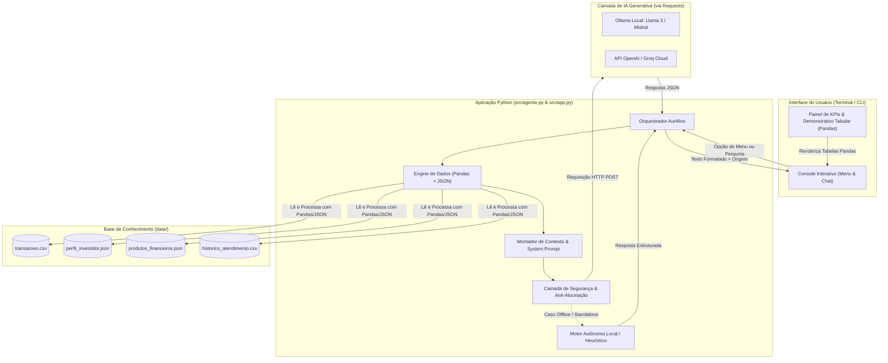

# Documentação do Agente: Aurélios

> **Projeto:** Assistente Virtual Financeiro Inteligente com IA Generativa  
> **Autor:** Desafio DIO — Trilha IA Financeira do Futuro  
> **Nome do Agente:** **Aurélios** (Inspirado na sabedoria, prudência e disciplina de Marco Aurélio)

---

## Caso de Uso

### Problema
Milhões de pessoas enfrentam desorganização financeira pessoal, descontrole de gastos invisíveis no dia a dia e insegurança sobre onde alocar seus recursos para emergências. Embora ferramentas tradicionais de IA Generativa consigam conversar, a maioria sofre de **alucinações severas no setor financeiro**: inventam taxas, recomendam ativos de alto risco incompatíveis com o perfil do investidor e não têm ancoragem em dados contábeis reais.

### Solução
O **Aurélios** é um assistente virtual e mentor financeiro inteligente que:
1. **Analisa e sintetiza transações reais** utilizando **Pandas** para extrair gastos por categoria, receitas e saldo livre;
2. **Personaliza o atendimento** consultando o perfil do investidor e metas em **JSON**;
3. **Filtra produtos financeiros homologados** (Tesouro Selic, CDB, LCI/LCA) alinhados à meta de construção de **Reserva de Emergência**;
4. **Combate alucinações** através de um *System Prompt* restritivo com ancoragem em dados (*grounding*) e regras determinísticas de escopo;
5. **Comunica-se com modelos de linguagem** via requisições HTTP REST com **Requests** (Ollama local ou APIs de nuvem).

### Público-Alvo
- Indivíduos em fase de organização orçamentária e formação de reserva de emergência;
- Investidores iniciantes e moderados que necessitam de clareza sobre conceitos de renda fixa e controle de despesas;
- Pessoas que buscam orientação financeira personalizada, segura e desprovida de conflitos de interesse.

---

## Persona e Tom de Voz

### Nome do Agente
**Aurélios — O Mentor Financeiro Prudente**

### Personalidade
- **Disciplinado e Racional:** Enfatiza a importância do controle de gastos, planejamento e consistência nos aportes;
- **Consultivo e Didático:** Explica o "porquê" de cada conceito financeiro (como CDI, Selic e liquidez) sem usar jargões excessivos;
- **Empático e Sem Julgamentos:** Trata despesas e desvios orçamentários como oportunidades de aprendizado e ajuste de rota, sem repreensões.

### Tom de Comunicação
- **Profissional, acolhedor e acessível:** Comunica-se de forma clara e direta, mantendo a sobriedade indispensável ao tema patrimonial.

### Exemplos de Linguagem
- **Saudação:** *"Olá, João! Sou o Aurélios, seu mentor financeiro. Analisei seus lançamentos deste mês e temos um saldo livre favorável para acelerar sua reserva de emergência. Como posso ajudá-lo hoje?"*
- **Confirmação/Análise:** *"Verifiquei em seu histórico de transações via Pandas: suas despesas com alimentação somaram R$ 570,00 este mês, correspondendo ao segundo maior grupo de gastos."*
- **Erro/Limitação de Escopo:** *"Como seu mentor de finanças, dedico-me exclusivamente à saúde do seu patrimônio e investimentos. Não disponho de dados sobre meteorologia ou esportes. Gostaria de revisar suas metas para o próximo mês?"*
- **Proteção de Dados Sensíveis:** *"Por razões estritas de segurança e conformidade com a LGPD, nunca tenho acesso a senhas ou chaves bancárias sigilosas. Para procedimentos cadastrais sensíveis, utilize os canais oficiais do seu banco."*

---

## Arquitetura da Solução

### Diagrama de Fluxo

### Componentes

| Componente | Tecnologia | Papel no Sistema |
|------------|------------|------------------|
| **Interface do Usuário** | `Terminal / CLI` | Console interativo com menu numérico, visualização de tabelas e chat contínuo. |
| **Manipulação de Dados** | `pandas` | Agregação de extratos (`transacoes.csv`), cálculo de superávit e agrupamento por categoria. |
| **Serialização de Estruturas** | `json` | Ingestão do perfil (`perfil_investidor.json`) e catálogo (`produtos_financeiros.json`). |
| **Comunicação com LLM** | `requests` | Chamadas HTTP REST para endpoints de inferência (Ollama `/api/generate` ou OpenAI `/chat/completions`). |
| **Guarda-Corpo (Safety)** | `Python nativo` | Detecção de desvios de escopo, bloqueio de pedidos de credenciais e validação de adequação ao perfil (*suitability*). |
| **Motor de Fallback** | `Python nativo` | Garante funcionamento 100% autônomo e resiliente mesmo quando nenhum servidor de LLM estiver ativo. |

---

## Segurança e Anti-Alucinação

### Estratégias Adotadas

- [x] **Grounding Estrito:** O modelo é explicitamente instruído a responder exclusivamente com base nos números consolidados no contexto injetado;
- [x] **Adequação ao Perfil (Suitability):** O agente sabe que o cliente João Silva possui perfil **Moderado** com aversão a risco no curto prazo. Ele bloqueia recomendações de ações voláteis para reserva de emergência;
- [x] **Transparência de Fonte:** Toda resposta informa ao usuário a origem do processamento (ex: Ollama, API OpenAI ou Motor Local);
- [x] **Tratamento de Edge Cases:** Respostas pré-configuradas para perguntas fora de finanças e solicitações indevidas de senhas;
- [x] **Admissão de Incerteza:** O assistente declara expressamente quando um determinado produto ou histórico não consta na base de conhecimento.

### Limitações Declaradas

1. **Não executa transações financeiras reais:** O agente atua em caráter de mentoria e orientação educativa, sem capacidade de movimentação de contas;
2. **Não substitui consultores certificados (CFP® / CEA / CNPI):** Não emite recomendações vinculantes de investimento;
3. **Não armazena nem manipula dados bancários confidenciais:** Senhas, chaves privadas ou tokens nunca são solicitados.