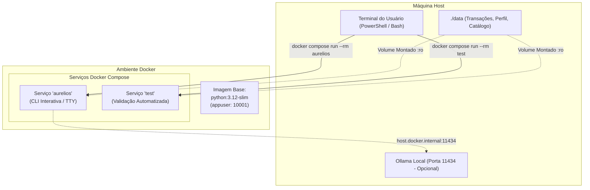

# Etapa 6: Implantação e Conteinerização com Docker

> **Aurélios — Assistente Virtual Financeiro: Dicas de Investimento e Economia**  
> Guia completo de conteinerização, arquitetura Docker Compose, execução interativa CLI e integração de serviços.

---

## 1. Visão Geral da Conteinerização

O **Aurélios** foi empacotado em containers Docker utilizando as melhores práticas da indústria (multi-stage readiness, usuário não privilegiado `appuser`, variáveis de ambiente limpas e cache otimizado de camadas).

A solução Docker permite que qualquer usuário ou avaliador execute o assistente financeiro em **qualquer sistema operacional** (Windows, Linux, macOS) com isolamento completo de dependências, sem necessidade de instalar Python ou bibliotecas localmente.



---

## 2. Arquivos de Configuração Docker

A estrutura Docker do projeto é composta por:

| Arquivo | Função |
|---|---|
| [`Dockerfile`](../Dockerfile) | Especificação da imagem base (`python:3.12-slim`), criação de usuário sem privilégios (`appuser`), instalação otimizada do Pandas e Requests via `requirements.txt`. |
| [`compose.yaml`](../compose.yaml) | Orquestração dos serviços (`aurelios` para CLI interativa e `test` para testes contínuos), montagem de volumes e mapeamento de rede. |
| [`.dockerignore`](../.dockerignore) | Otimização do build context, excluindo arquivos locais (`.venv`, `__pycache__`, `docs/`, `assets/`). |

---

## 3. Serviços Disponíveis no `compose.yaml`

O projeto possui dois serviços principais prontos para uso:

### 3.1. `aurelios` (Aplicação Principal)
* **Objetivo:** Executar o assistente financeiro interativo no terminal.
* **Recursos configurados:**
  * `stdin_open: true` e `tty: true`: viabilizam menus interativos e entrada de texto contínua pelo teclado;
  * `volumes: ./data:/app/data:ro`: lê a base de conhecimento mockada em tempo real (qualquer edição em `data/` reflete imediatamente no container sem necessidade de rebuild);
  * `extra_hosts: host.docker.internal:host-gateway`: permite conexão com o Ollama ou outros serviços rodando na máquina host.

### 3.2. `test` (Suíte de Testes)
* **Objetivo:** Executar a suíte de testes analíticos e heurísticos sem intervenção manual.
* **Comando interno:** `python src/test_agente.py`.

---

## 4. Guia de Execução

### Passo 1: Construir a Imagem Docker
No diretório raiz do projeto, execute:
```bash
docker compose build
```

*(Ou usando Docker puro: `docker build -t aurelios .`)*

---

### Passo 2: Executar o Assistente Interativamente

Por ser uma aplicação de terminal interativa com menus e prompt livre, execute com alocação de TTY:

```bash
docker compose run --rm aurelios
```

*(Ou usando Docker puro: `docker run -it --rm aurelios`)*

O assistente inicializará imediatamente com o menu funcional e você poderá interagir digitando as opções ou perguntas financeiras diretamente no console.

---

### Passo 3: Executar a Suíte de Testes Automatizados

Para validar o funcionamento do agente, cálculos contábeis do Pandas e cenários de anti-alucinação dentro do container:

```bash
docker compose run --rm test
```

Resultado esperado:
```text
============================================================
[*] INICIANDO TESTES DO ASSISTENTE FINANCEIRO AURELIOS
============================================================
[OK] 1. Carregamento de dados (JSON e Pandas): SUCESSO
[OK] 2. Calculos agregados com Pandas: SUCESSO (100% de precisao)
[OK] 3. Metricas de Reserva de Emergencia: SUCESSO
[OK] 4. Montagem de Contexto Grounded: SUCESSO
============================================================
[SUCESSO] TODOS OS TESTES PASSARAM COM 100% DE EFICACIA!
============================================================
```

---

## 5. Integração com Provedores de IA no Docker

| Provedor | Como Usar no Docker |
|---|---|
| **Motor Autônomo Local (Padrão)** | Não requer nenhuma configuração externa. Funciona 100% offline dentro do container. |
| **Ollama no Host** | Certifique-se de que o Ollama está rodando no computador. O serviço `aurelios` já vem pré-configurado com a variável `OLLAMA_URL=http://host.docker.internal:11434/api/generate`. |
| **APIs na Nuvem (OpenAI / Groq)** | Passe a sua chave via variável de ambiente: <br>`docker compose run -e OPENAI_API_KEY="sk-..." --rm aurelios` |

---

## 6. Boas Práticas Adotadas

1. **Segurança (Least Privilege):** Não roda como `root`. Utiliza o usuário `appuser` (UID 10001);
2. **Camadas em Cache (Docker Layer Caching):** `requirements.txt` é copiado e instalado antes do código-fonte para builds incrementais ultrarrápidos;
3. **Encoding Seguro:** Forçado `PYTHONUNBUFFERED=1` e `PYTHONIOENCODING=utf-8` para garantir exibição correta de caracteres em português (acentos, cedilha, símbolos monetários R$);
4. **Volumes Somente Leitura (`:ro`):** Protege a base de dados de corrupção acidental por escrita dentro do container.
